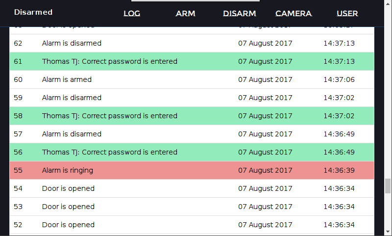
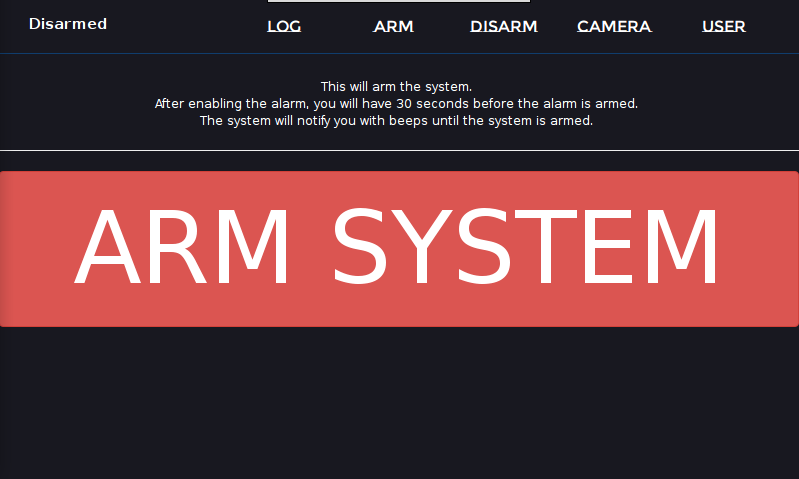
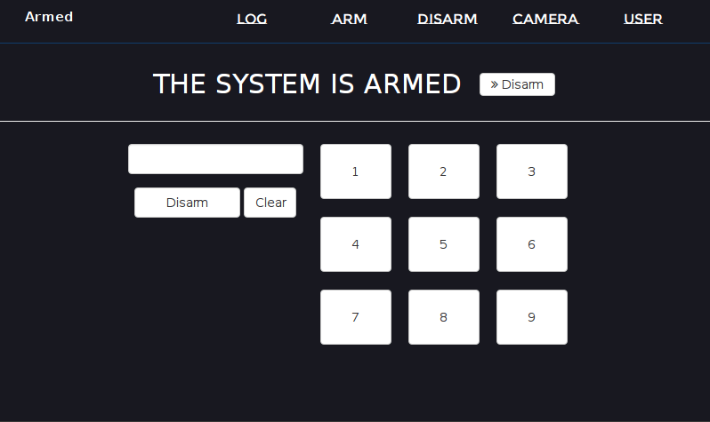
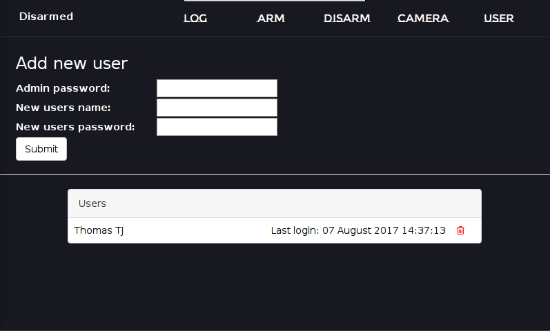

# General
__Program:__ Alarmsystem

__Sub-program1:__ alarm

__Sub-program2:__ alarm-slave


# Description
This program is a alarm system for the Raspberry Pi programmed in Nim.

The program consist of 2 programs. 1 main program (the controller) and a slave. The controller package/folder is named 'alarm', while the slave package is named 'alarm-slave'. At the moment you have to manually add more slaves. Next release will include automatic adding of slaves.

# Screenshots










# Requirements
## Install
### Nim
Use your packagemanager or visit https://nim-lang.org/install_unix.html and download the tarball with the newest Nim release.
```
cd into the unpacked Nim folder
sh build.sh
bin/nim c koch
./koch tools
ln -s /home/pi/nim-0.17.0/bin/nim /usr/bin/nim
ln -s /home/pi/nim-0.17.0/bin/nimble /usr/bin/nimble
```


### Nimble
Nimble is part of the your newly installed Nim package. You need the following Nim libraries.
- jester
- bcrypt
- slacklib
- wiringPiNim

```
cd ~
nimble install jester
nimble install bcrypt
nimble install slacklib
nimble install wiringPiNim
```
 ## Adjust
Adjust `config-default.cfg` in __both__ the alarm-main and the alarm-slave folder.

Rename the `config-default.cfg` to `config.cfg`.

## Raspberry Pi equipment
Raspberry Pi:
- Testet on Raspberry Pi 3
- Raspbian Jessie 2017-07-05, kernel 4.9
- WiFi connection

The controller (the pins is specified in the config):
- Touchscreen (style.css uses 720x480)
- PIR
- Buzzer
- LED (incl. 330 Ohm)

The slave (the pins is specified in the config):
- Camera
- Magnetic door contact

## Optional

### RPi-Cam-Web-Interface
To enable the camera for the slave 1 run:

```
ssh pi@slave1(your local IP)
cd ~
git clone https://github.com/silvanmelchior/RPi_Cam_Web_Interface.git
cd RPi_Cam_Web_Interface
./install.sh
# If you choose another port than 8081, then adjust it in the config.cfg
```

### Slack integration
The alarm system is prepared for integration with a slack channel. You need to setup a slack app to communicate with and include your specifications in the `config.cfg`. 

#### Slack account
Get a slack account (https://slack.com)

#### Slack app
You need to build a slack app to communicate with.

1) Create a new slack app (https://api.slack.com/apps/new)
2) Add the permissions depending on your needs: Incoming webhooks, Slash commands, Permissions
3) Install the app to your team
4) Scopes: commands, incoming webhooks

In the command section, you need to add (text in the () is only information for you):
* /arm (will arm the alarm)
* /disarm (will disarm the alarm, if the correct password is provided. E.g. /disarm passwrod)
* /log (return the last 10 entries in the log. You can specify the number of entries with /log 14)
* /led (/led off = turns off the led, on:green = green is on, on:blue, on:red)
* /buzzer (/buzzer on = turn on the buzzer, /buzzer off)
* /pir (/pir password = turn the PIR off. For turning on again, disarm and arm)

#### Router
You need to open the slackPort in your router to communicate with slack.

### Remove mouse cursor

On the Raspberry pi:

```
sudo apt-get install unclutter
nano ~/.config/lxsession/LXDE-pi/autostart
# Add the line at the bottom:
@unclutter -idle 0
# Save and exit nano: Ctrl+o & Ctrl+x
```

### Chrome-browser
- chromium (standard on the Raspbian Jessie)

The webpage on the main controller is loaded as a kiosk in the `main.nim`. Command for the chrome-browser is included in the config file. If another browser is prefeered, then remember to change the command. 

To exit the kiosk with ssh `kill -9` or VNC with `Ctrl + W`.

### Caddy 
- caddy

With caddy you can create a local webserver for jester (nim library). There is some GUI/loading problems, when accessing the alarm system on LAN network.
Remember to adjust ressources/Caddyfile to your system.

```
curl https://getcaddy.com | bash
sudo caddy -conf ressouces/Caddyfile
```


# How to run it

## The controller

1) Copy the folder `alarm-main` to the controller (your main raspberry pi)
2) Open and adjust config-default.cfg and rename it to config.cfg (`nano config-default.cfg` & `mv config-default.cfg config.cfg`)
3) Run `nim c -r compile.nim` to generate the sqlite database
4) Run `nim c -d:ssl -d:release main.nim`
5) Optional: Open and adjust the Caddyfile with the controllers LAN IP (`nano ressources/Caddyfile`)
6) Run `./main` or `sudo ./main`

## The slave

1) Copy the folder `alarm-slave` to the slave
2) Open and adjust config-default.cfg and rename it to config.cfg (`nano config-default.cfg` & `mv config-default.cfg config.cfg`)
3) Run `nim c -d:release main.nim`
4) Run `./main` or `sudo ./main`

## Running

If kioskmode is disabled, then access the frontpage on the controllers touchscreen: `127.0.0.1:6001`

If kioskmode is on, chrome-browser will launch on the frontpage.

# Auto run on boot

To enable auto run, include the following in .profile, crontab, init.d or somewhere else. Please notice, that Caddy needs sudo due to port assignment.

By using .profile as below, your Pi needs to autologin.
```
nano ~/.profile
# Add the line below to the bottom of file on main controller
cd /home/pi/Documents/rpi/alarm-main ; nohup ./main > /dev/null 2>&1&
```
```
nano ~/.profile
# Add the line below to the bottom of file on slave
cd /home/pi/Documents/rpi/alarm-slave ; nohup ./main > /dev/null 2>&1&
```

Caddy (optional):
```
sudo nohup caddy -conf /home/user/rpi/alarm/ressources/Caddyfile > /dev/null 2>&1&
```

## Errors on run on boot

Due to import of config.cfg, you have to navigate to the folder before you can run the ./main.


# Credit

Password hashing and salting - all credits to: https://github.com/nim-lang/nimforum